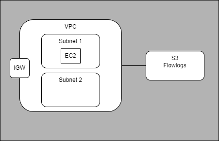

# Terraform Demo AWS

## Demo environment


### Check terraform plan
```bash
terraform -chdir=terraform plan --out tfplan.binary
terraform -chdir=terraform show -json tfplan.binary > tfplan.json
checkov -f tfplan.json
```
